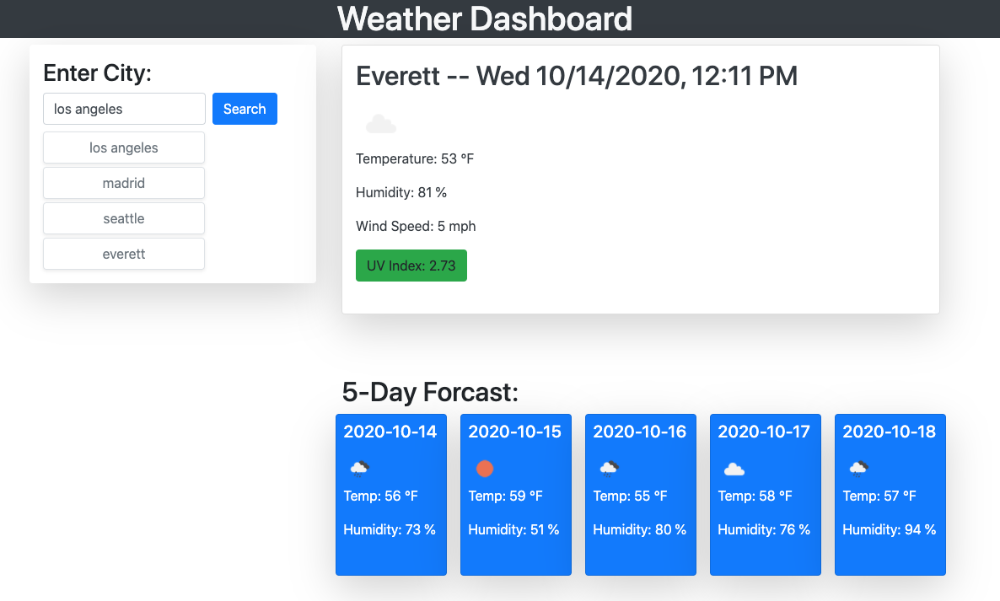

# Weather-Dashboard-HW6

INTRUDUCTION

This is a Weather Dashboard using data from the Openweather API.  It displays the current date, time weather, a five days forcast and a list of cities searched.

USER INTERFACE

The user is presented with a blank weather dashboard and a search box to enter a city name, after the city name has been entered and the seaech button pressed, thecurrent weather and five day forecast is displayed.

USER STEPS

A blank weather dashboard is presented.  The following steps need to be taken to retrive weather information from a city:

1 - Type a city name in the search field.
2 - Click on the search button.
3 - search for another city.
4 - to see previously searched cities click on the button created below the search field.

APPLICATION URLs:

Deployed application:  https://samrod777.github.io/Weather-Dashboard-HW6

GitHub repository URL: https://github.com/samrod777/Weather-Dashboard-HW6

© 2020 Sam Rodriguez. All Rights Reserved.